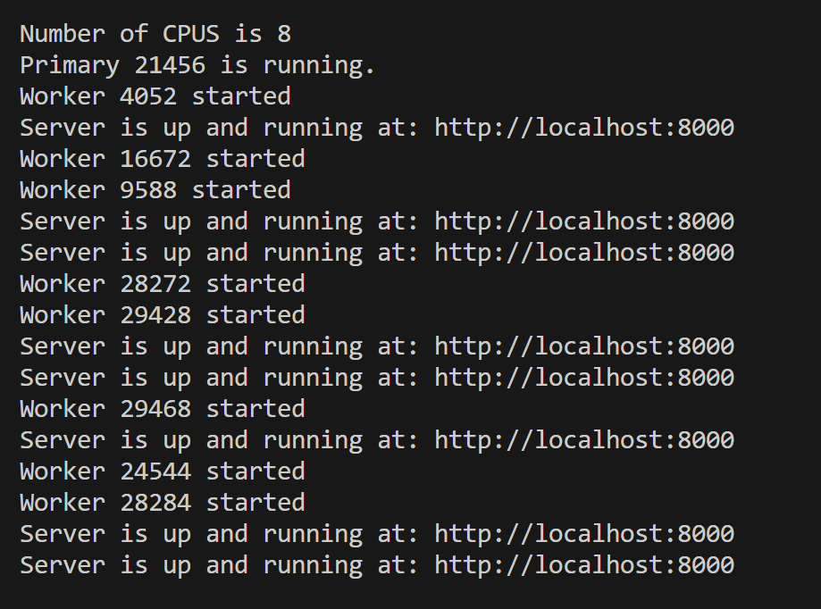

# Vertical Scaling:
Formal Definition and Concept: `Vertical scaling typically refers to increasing the resources (CPU, memory) of a single machine to handle a larger workload`. The code which leverages the `cluster` module, which `allows you to fork multiple child processes (each utilizing a CPU core), mimicking parallel processing`. However, `it's not true multithreading since JavaScript (and Node.js) is single-threaded, but rather it creates multiple isolated processes (workers) to share the load.`

1. Ugly way to spawn multiple Node.js processes is by running `node index.js` manually. Instead we can use the `cluster` module.
2. Have to keep track of each process and how they are performing.
   
3. Spawning a process is much more heavyweight than the multithreading itself.
4. Can't run the node.js process on the same port, so we'll have to take care of the port conflicts too!
5. Best for multi-threaded languages like Rust, Java, C++, Go.

## Discussion of code for Vertical Scaling:

- Single-threaded nature of Node.js:
  Node.js uses a single thread to handle events and asynchronous tasks. This can become a bottleneck for CPU-intensive tasks since the event loop is blocked until the task finishes.
- Cluster Module:
  1. The cluster module is used to fork child processes that run on different CPU cores. These child processes can handle HTTP requests, allowing multiple tasks to run concurrently.
  2. Each child process has its own memory, event loop, and V8 engine instance, meaning it doesn’t share resources with others directly.

### Is this Multithreading?

No, this is not true multithreading. Instead:

- Node.js is single-threaded, but the cluster module allows you to run multiple processes.
- Each worker process has its own memory space, event loop, and V8 engine instance.
- There's no shared memory(threads share memory btw) between workers unless you explicitly use something like SharedArrayBuffer or IPC (Inter-Process Communication) to transfer data.

### Workers in Node.js

- A worker is a child process created by the cluster module that runs on a separate CPU core.
- Each worker listens to HTTP requests and can perform its own tasks independently.
- Workers improve throughput by distributing load across multiple CPU cores, especially for high concurrency.

### Cluster Module Use Cases

- When to use:

1. CPU-bound tasks: When you need to handle heavy computation, such as calculating large sums or processing large datasets.
2. Multi-core systems: When running on servers with multiple CPU cores, cluster helps balance the load.
3. High-concurrency applications: Useful in apps where a large number of requests are made, and each request needs its own processing thread (e.g., HTTP servers).

- When to avoid:

1. Memory-intensive applications: Since each worker process has its own memory space, if your app uses large amounts of memory, forking many processes can cause excessive memory usage.
2. Low-latency apps: The cost of creating and managing worker processes can add overhead.

### Comparison: Single-threaded Async vs Cluster-based Multi-Processing

- Async behavior in Node.js lets you handle non-blocking I/O efficiently even in a single thread, but it struggles with CPU-bound tasks.
- Cluster-based multi-processing doesn’t make JavaScript multi-threaded but instead distributes work across multiple processes, each handling tasks concurrently.
- `C++ threads create true multithreading where multiple threads run within the same process and share memory.`
- Each thread performs its own task and uses CPU cores effectively for CPU-bound operations.

#### Multithreading: Same process &rarr; multiple threads

#### Multiprocessing: Multiple processes running on different cores

# ASG: Auto Scaling Groups

- These scale on the base of average CPU usage.
- An aggregation service aggregates/ calculates average/finds the number of users coming to the servers we setup.
- We use an aggregtion service to tell the ASG to scale up and down depending on if the number of users increase or decrease.
